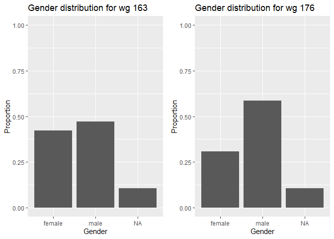
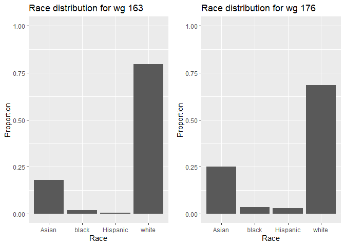
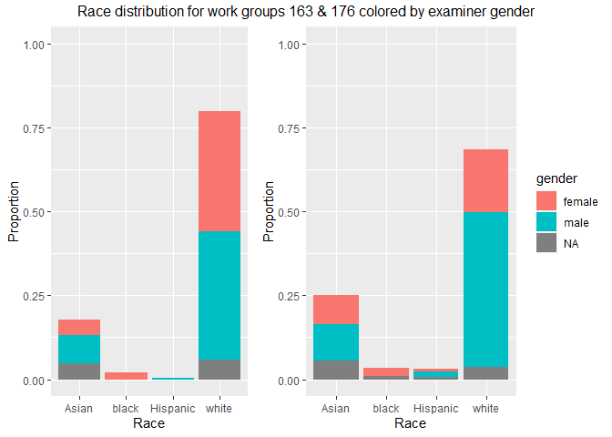
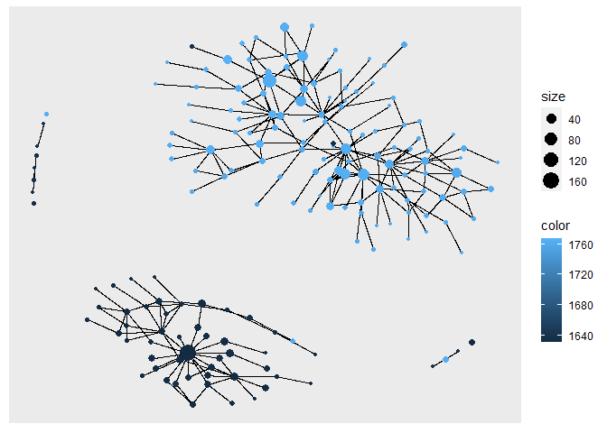

Exercise3
================

## Libraries

``` r
library(ggraph)
library(igraph)

library(arrow)
library(tidyverse)
library(gender)
library(wru)
library(lubridate)

library(ggplot2)
library(gridExtra)
library(grid)
```

## Data

``` r
# change to your own path!
data_path <- "Data/"
applications <- read_parquet(paste0(data_path,"app_data_sample.parquet"))
edges <- read_csv(paste0(data_path,"edges_sample.csv"))
```

## Add gender

``` r
# get a list of first names without repetitions
examiner_names <- applications %>% 
  distinct(examiner_name_first)

# get a table of names and gender
examiner_names_gender <- examiner_names %>% 
  do(results = gender(.$examiner_name_first, method = "ssa")) %>% 
  unnest(cols = c(results), keep_empty = TRUE) %>% 
  select(
    examiner_name_first = name,
    gender,
    proportion_female
  )
# remove extra columns from the gender table
examiner_names_gender <- examiner_names_gender %>% 
  select(examiner_name_first, gender)

# joining gender back to the dataset
applications <- applications %>% 
  left_join(examiner_names_gender, by = "examiner_name_first")

# cleaning up
rm(examiner_names)
rm(examiner_names_gender)
gc()
```

    ##            used  (Mb) gc trigger  (Mb) max used  (Mb)
    ## Ncells  4706970 251.4    8237090 440.0  4726516 252.5
    ## Vcells 49733500 379.5   95691220 730.1 80049059 610.8

## Add race

``` r
# get list of distinct last names
examiner_surnames <- applications %>% 
  select(surname = examiner_name_last) %>% 
  distinct()

examiner_race <- predict_race(voter.file = examiner_surnames, surname.only = T) %>% 
  as_tibble()
```

    ## [1] "Proceeding with surname-only predictions..."

``` r
# infer racial probabilities from surname tibble
examiner_race <- examiner_race %>% 
  mutate(max_race_p = pmax(pred.asi, pred.bla, pred.his, pred.oth, pred.whi)) %>% 
  mutate(race = case_when(
    max_race_p == pred.asi ~ "Asian",
    max_race_p == pred.bla ~ "black",
    max_race_p == pred.his ~ "Hispanic",
    max_race_p == pred.oth ~ "other",
    max_race_p == pred.whi ~ "white",
    TRUE ~ NA_character_
  ))

# removing extra columns and merge into application data
examiner_race <- examiner_race %>% 
  select(surname,race)

applications <- applications %>% 
  left_join(examiner_race, by = c("examiner_name_last" = "surname"))
# cleanup
rm(examiner_race)
rm(examiner_surnames)
gc()
```

    ##            used  (Mb) gc trigger  (Mb) max used  (Mb)
    ## Ncells  5046983 269.6    8237090 440.0  5686135 303.7
    ## Vcells 53420059 407.6   95691220 730.1 94207598 718.8

## Add tenure

``` r
# get all application filing dates
examiner_dates <- applications %>% 
  select(examiner_id, filing_date, appl_status_date) 

# calculate start and end date from filing / status date respectively
examiner_dates <- examiner_dates %>% 
  mutate(start_date = ymd(filing_date), end_date = as_date(dmy_hms(appl_status_date)))

# for each examiner, get earliest and latest days, then interval between them as tenure in days
examiner_dates <- examiner_dates %>% 
  group_by(examiner_id) %>% 
  summarise(
    earliest_date = min(start_date, na.rm = TRUE), 
    latest_date = max(end_date, na.rm = TRUE),
    tenure_days = interval(earliest_date, latest_date) %/% days(1)
    ) %>% 
  filter(year(latest_date)<2018)

# merge and clean
applications <- applications %>% 
  left_join(examiner_dates, by = "examiner_id")

rm(examiner_dates)
gc()
```

    ##            used  (Mb) gc trigger   (Mb)  max used   (Mb)
    ## Ncells  5061033 270.3   14706428  785.5  14706428  785.5
    ## Vcells 65798819 502.1  137971356 1052.7 137856919 1051.8

## Subset two workgroups for analysis

``` r
wg163 = applications[substr(applications$examiner_art_unit, 1,3)==163,]
wg176 = applications[substr(applications$examiner_art_unit, 1,3)==176,]

wg163
```

    ## # A tibble: 90,860 x 21
    ##    application_number filing_date examiner_name_last examiner_name_first
    ##    <chr>              <date>      <chr>              <chr>              
    ##  1 08776818           2000-02-04  STRZELECKA         TERESA             
    ##  2 08973360           2000-02-09  LI                 QIAN               
    ##  3 09011075           2000-05-03  FORMAN             BETTY              
    ##  4 09077619           2000-03-31  STRZELECKA         TERESA             
    ##  5 09142080           2000-05-11  FREDMAN            JEFFREY            
    ##  6 09142314           2000-06-01  SISSON             BRADLEY            
    ##  7 09171671           2000-05-01  WESSENDORF         TERESA             
    ##  8 09202838           2000-01-21  ZHOU               SHUBO              
    ##  9 09202969           2003-11-03  LIU                SUE                
    ## 10 09242244           2000-02-29  WOITACH            JOSEPH             
    ## # ... with 90,850 more rows, and 17 more variables: examiner_name_middle <chr>,
    ## #   examiner_id <dbl>, examiner_art_unit <dbl>, uspc_class <chr>,
    ## #   uspc_subclass <chr>, patent_number <chr>, patent_issue_date <date>,
    ## #   abandon_date <date>, disposal_type <chr>, appl_status_code <dbl>,
    ## #   appl_status_date <chr>, tc <dbl>, gender <chr>, race <chr>,
    ## #   earliest_date <date>, latest_date <date>, tenure_days <dbl>

## Demographics analysis

``` r
# summary statistics

summary(wg163)
```

    ##  application_number  filing_date         examiner_name_last examiner_name_first
    ##  Length:90860       Min.   :2000-01-02   Length:90860       Length:90860       
    ##  Class :character   1st Qu.:2003-12-19   Class :character   Class :character   
    ##  Mode  :character   Median :2007-12-17   Mode  :character   Mode  :character   
    ##                     Mean   :2008-02-03                                         
    ##                     3rd Qu.:2011-11-21                                         
    ##                     Max.   :2017-04-27                                         
    ##                                                                                
    ##  examiner_name_middle  examiner_id    examiner_art_unit  uspc_class       
    ##  Length:90860         Min.   :59156   Min.   :1631      Length:90860      
    ##  Class :character     1st Qu.:67173   1st Qu.:1633      Class :character  
    ##  Mode  :character     Median :75340   Median :1635      Mode  :character  
    ##                       Mean   :78698   Mean   :1635                        
    ##                       3rd Qu.:93760   3rd Qu.:1637                        
    ##                       Max.   :99764   Max.   :1639                        
    ##                       NA's   :861                                         
    ##  uspc_subclass      patent_number      patent_issue_date   
    ##  Length:90860       Length:90860       Min.   :2000-12-12  
    ##  Class :character   Class :character   1st Qu.:2007-08-28  
    ##  Mode  :character   Mode  :character   Median :2011-05-31  
    ##                                        Mean   :2010-10-24  
    ##                                        3rd Qu.:2013-12-17  
    ##                                        Max.   :2017-06-20  
    ##                                        NA's   :53499       
    ##   abandon_date        disposal_type      appl_status_code appl_status_date  
    ##  Min.   :1990-07-01   Length:90860       Min.   :  1.0    Length:90860      
    ##  1st Qu.:2006-11-13   Class :character   1st Qu.:150.0    Class :character  
    ##  Median :2009-10-27   Mode  :character   Median :161.0    Mode  :character  
    ##  Mean   :2009-12-02                      Mean   :148.9                      
    ##  3rd Qu.:2013-01-23                      3rd Qu.:161.0                      
    ##  Max.   :2017-05-31                      Max.   :854.0                      
    ##  NA's   :49524                           NA's   :134                        
    ##        tc          gender              race           earliest_date       
    ##  Min.   :1600   Length:90860       Length:90860       Min.   :2000-01-02  
    ##  1st Qu.:1600   Class :character   Class :character   1st Qu.:2000-01-10  
    ##  Median :1600   Mode  :character   Mode  :character   Median :2000-02-04  
    ##  Mean   :1600                                         Mean   :2000-10-02  
    ##  3rd Qu.:1600                                         3rd Qu.:2000-11-20  
    ##  Max.   :1600                                         Max.   :2010-09-10  
    ##                                                       NA's   :2820        
    ##   latest_date          tenure_days  
    ##  Min.   :2000-12-14   Min.   : 251  
    ##  1st Qu.:2017-05-19   1st Qu.:6016  
    ##  Median :2017-05-20   Median :6296  
    ##  Mean   :2017-04-27   Mean   :6051  
    ##  3rd Qu.:2017-05-22   3rd Qu.:6339  
    ##  Max.   :2017-05-23   Max.   :6349  
    ##  NA's   :2820         NA's   :2820

``` r
summary(wg176)
```

    ##  application_number  filing_date         examiner_name_last examiner_name_first
    ##  Length:91376       Min.   :2000-01-03   Length:91376       Length:91376       
    ##  Class :character   1st Qu.:2004-06-15   Class :character   Class :character   
    ##  Mode  :character   Median :2010-09-09   Mode  :character   Mode  :character   
    ##                     Mean   :2009-07-28                                         
    ##                     3rd Qu.:2013-11-14                                         
    ##                     Max.   :2017-05-03                                         
    ##                                                                                
    ##  examiner_name_middle  examiner_id    examiner_art_unit  uspc_class       
    ##  Length:91376         Min.   :59096   Min.   :1761      Length:91376      
    ##  Class :character     1st Qu.:66691   1st Qu.:1762      Class :character  
    ##  Mode  :character     Median :76370   Median :1763      Mode  :character  
    ##                       Mean   :80175   Mean   :1764                        
    ##                       3rd Qu.:94668   3rd Qu.:1765                        
    ##                       Max.   :99930   Max.   :1768                        
    ##                       NA's   :404                                         
    ##  uspc_subclass      patent_number      patent_issue_date   
    ##  Length:91376       Length:91376       Min.   :2000-06-06  
    ##  Class :character   Class :character   1st Qu.:2006-05-02  
    ##  Mode  :character   Mode  :character   Median :2012-11-20  
    ##                                        Mean   :2011-03-15  
    ##                                        3rd Qu.:2015-03-24  
    ##                                        Max.   :2017-06-20  
    ##                                        NA's   :38860       
    ##   abandon_date        disposal_type      appl_status_code appl_status_date  
    ##  Min.   :1965-07-20   Length:91376       Min.   : 17      Length:91376      
    ##  1st Qu.:2006-11-13   Class :character   1st Qu.:150      Class :character  
    ##  Median :2012-05-30   Mode  :character   Median :150      Mode  :character  
    ##  Mean   :2011-03-31                      Mean   :148                        
    ##  3rd Qu.:2014-10-14                      3rd Qu.:161                        
    ##  Max.   :2017-06-05                      Max.   :454                        
    ##  NA's   :66966                           NA's   :182                        
    ##        tc          gender              race           earliest_date       
    ##  Min.   :1700   Length:91376       Length:91376       Min.   :2000-01-03  
    ##  1st Qu.:1700   Class :character   Class :character   1st Qu.:2000-01-06  
    ##  Median :1700   Mode  :character   Mode  :character   Median :2000-01-20  
    ##  Mean   :1700                                         Mean   :2002-04-10  
    ##  3rd Qu.:1700                                         3rd Qu.:2004-12-29  
    ##  Max.   :1700                                         Max.   :2012-07-03  
    ##                                                       NA's   :1017        
    ##   latest_date          tenure_days  
    ##  Min.   :2001-02-22   Min.   : 339  
    ##  1st Qu.:2017-05-19   1st Qu.:4524  
    ##  Median :2017-05-22   Median :6294  
    ##  Mean   :2017-05-03   Mean   :5501  
    ##  3rd Qu.:2017-05-23   3rd Qu.:6342  
    ##  Max.   :2017-05-23   Max.   :6350  
    ##  NA's   :1017         NA's   :1017

Tenure range: 339-6350

``` r
a <- ggplot(data=wg163, aes(x=gender)) +
  geom_bar(aes(y = (..count..)/sum(..count..)) )  +
  ylab("Proportion")+
  xlab("Gender")+
  ylim(0,1)+
  ggtitle(paste0("Gender distribution for wg 163"))

b <- ggplot(data=wg176, aes(x=gender)) +
  geom_bar(aes(y = (..count..)/sum(..count..))) +
  ylab("Proportion")+
  xlab("Gender")+
  ylim(0,1)+
  ggtitle(paste0("Gender distribution for wg 176"))
grid.arrange(a,b,ncol=2, widths=c(1,1))
```

<!-- --> We notice
176 has a much more male-skewed population, lets now repeat for race…

``` r
a <- ggplot(data=wg163, aes(x=race)) +
  geom_bar(aes(y = (..count..)/sum(..count..)) )  +
  ylab("Proportion")+
  xlab("Race")+
  ylim(0,1)+
  ggtitle(paste0("Race distribution for wg 163"))

b <- ggplot(data=wg176, aes(x=race)) +
  geom_bar(aes(y = (..count..)/sum(..count..))) +
  ylab("Proportion")+
  xlab("Race")+
  ylim(0,1)+
  ggtitle(paste0("Race distribution for wg 176"))
grid.arrange(a,b,ncol=2, widths=c(1,1))
```

<!-- --> Both are
predominantly white, though perhaps 176 by a bit smaller margin.

We could choose to look at both race and gender at the same time:

``` r
a <- ggplot(data=wg163, aes(x=race)) +
  geom_bar(aes(y = (..count..)/sum(..count..), fill=gender  ), show.legend=FALSE )  +
  ylab("Proportion")+
  ylim(0,1)+
  xlab("Race")
b <- ggplot(data=wg176, aes(x=race)) +
  geom_bar(aes(y = (..count..)/sum(..count..), fill=gender  ) )  +
  ylab("Proportion")+
  ylim(0,1)+
  xlab("Race")
grid.arrange(a,b,ncol=2, widths=c(1,1.4), top=textGrob("Race distribution for work groups 163 & 176 colored by examiner gender"))
```

<!-- --> In this
view, the male-female unbalance among 176-ers is mostly accounted for by
the white population.

## Advice networks

``` r
# first get work group for each examiner and limit to our two wgs of interest
examiner_aus = distinct(subset(applications, select=c(examiner_art_unit, examiner_id)))
# we eventually want to make a network with nodes colored by work group, so lets add that indicator
examiner_aus$wg = substr(examiner_aus$examiner_art_unit, 1,3)
# restrict down to our selected art units to reduce merging complexity later on
examiner_aus = examiner_aus[examiner_aus$wg==163 | examiner_aus$wg==176,]

# now we will merge in the aus df on applications 
tM = merge(x=edges, y=examiner_aus, by.x="ego_examiner_id", by.y="examiner_id", all.x=TRUE)
tM = tM %>% rename(ego_art_unit=examiner_art_unit, ego_wg=wg)
# drop the examiner edges who are not in 163 or 176
tM = drop_na(tM)

# now repeat for the alter examiners
tM = merge(x=tM, y=examiner_aus, by.x="alter_examiner_id", by.y="examiner_id", all.x=TRUE)
tM = tM %>% rename(alter_art_unit=examiner_art_unit, alter_wg=wg)
tM = drop_na(tM)
# we are left with 870 edges corresponding to instances of examiners in wg163 or wg176 asking for advice


egoNodes = subset(tM, select=c(ego_examiner_id,ego_art_unit, ego_wg)) %>% rename(examiner_id=ego_examiner_id,art_unit=ego_art_unit,wg=ego_wg)
alterNodes = subset(tM, select=c(alter_examiner_id,alter_art_unit, alter_wg))%>% rename(examiner_id=alter_examiner_id,art_unit=alter_art_unit,wg=alter_wg)
nodes = rbind(egoNodes, alterNodes)
nodes = distinct(nodes)

# problem: when we reduce to the list of distinct vertices, we actually have more than we should, since some examiners move amongst art units/wgs in this data subset
nodes = nodes %>% group_by(examiner_id) %>% summarise(examiner_id=first(examiner_id), art_unit=first(art_unit), wg=first(wg))
```

``` r
adviceNet = graph_from_data_frame(d=tM, vertices=nodes, directed=TRUE)
adviceNet
```

    ## IGRAPH fecf75f DN-- 177 870 -- 
    ## + attr: name (v/c), art_unit (v/n), wg (v/c), application_number (e/c),
    ## | advice_date (e/n), ego_art_unit (e/n), ego_wg (e/c), alter_art_unit
    ## | (e/n), alter_wg (e/c)
    ## + edges from fecf75f (vertex names):
    ##  [1] 59816->71143 59816->71143 59870->59165 59975->95799 59975->92487
    ##  [6] 59975->92487 59975->95799 59975->94301 59975->94301 59975->71142
    ## [11] 59975->71142 59975->71142 59975->92487 59975->71142 59975->92487
    ## [16] 59975->94301 59975->94301 59975->94301 59975->63366 60706->65547
    ## [21] 61182->94737 61519->61519 61519->61519 61519->61519 61519->72253
    ## [26] 61519->72253 61519->72253 62064->94301 62064->93896 62064->93896
    ## + ... omitted several edges

``` r
# Calculate centralities and add as vertex attributes
Degree <- degree(adviceNet, v=V(adviceNet))
Betweenness <- betweenness(adviceNet)
Eigenvector <- evcent(adviceNet)$vector

V(adviceNet)$size = Degree
V(adviceNet)$eig = round(Eigenvector,2)
V(adviceNet)$bet = round(Betweenness,2)

V(adviceNet)$color = nodes$art_unit
```

``` r
#E(adviceNet)
```

``` r
centralities <- cbind(Degree, Eigenvector, Betweenness)
centralities = round(centralities,2)
centralities = data.frame(centralities)
```

``` r
V(adviceNet)
```

    ## + 177/177 vertices, named, from fecf75f:
    ##   [1] 59156 59165 59407 59816 59870 59975 60397 60706 61182 61299 61416 61519
    ##  [13] 62064 62164 62312 62621 63030 63188 63190 63234 63244 63277 63363 63366
    ##  [25] 63422 63532 63609 63735 63752 63938 63977 64002 64059 64073 65031 65131
    ##  [37] 65403 65474 65547 66118 66344 66450 66762 66971 67173 67331 67409 67515
    ##  [49] 68141 68169 68384 68511 69099 69209 69304 69539 69711 69800 70610 70887
    ##  [61] 70993 71087 71119 71120 71123 71142 71143 71243 71353 71385 71704 71762
    ##  [73] 71853 71931 72253 72613 72638 72809 72838 72848 72995 73213 73239 73327
    ##  [85] 73692 73880 74579 75341 75387 75461 75718 76081 76370 76622 77068 77294
    ##  [97] 78019 78056 78379 79495 80106 81337 82563 82735 83398 84157 84609 85449
    ## [109] 85599 85736 86201 86212 86861 87124 88202 88294 88443 89550 90946 91337
    ## + ... omitted several vertices

``` r
ggraph(adviceNet, layout="kk") +
  geom_edge_link()+
  geom_node_point(aes(size=size, color=color), show.legend=T)
```

<!-- -->

``` r
  #geom_node_text(aes(label=name))
```

Interestingly we do seem to have several instances of an examiner
leaving the confines of their workgroup and seeking advice from the
other (see the small components on the outer edges with both blue and
black nodes).

When we explore the centralities data frame, we also see there are two
nodes with much higher degree than the rest, examiner 72253 and examiner
84157. Who are these people?

``` r
applications[applications$examiner_id==72253,]
```

    ## # A tibble: 9,628 x 21
    ##    application_number filing_date examiner_name_last examiner_name_first
    ##    <chr>              <date>      <chr>              <chr>              
    ##  1 <NA>               NA          <NA>               <NA>               
    ##  2 09242244           2000-02-29  WOITACH            JOSEPH             
    ##  3 09402130           2000-02-02  WOITACH            JOSEPH             
    ##  4 09402527           2000-01-03  WOITACH            JOSEPH             
    ##  5 09403707           2000-03-17  WOITACH            JOSEPH             
    ##  6 09423935           2000-03-13  WOITACH            JOSEPH             
    ##  7 09446717           2000-04-13  WOITACH            JOSEPH             
    ##  8 <NA>               NA          <NA>               <NA>               
    ##  9 09463276           2000-05-12  WOITACH            JOSEPH             
    ## 10 <NA>               NA          <NA>               <NA>               
    ## # ... with 9,618 more rows, and 17 more variables: examiner_name_middle <chr>,
    ## #   examiner_id <dbl>, examiner_art_unit <dbl>, uspc_class <chr>,
    ## #   uspc_subclass <chr>, patent_number <chr>, patent_issue_date <date>,
    ## #   abandon_date <date>, disposal_type <chr>, appl_status_code <dbl>,
    ## #   appl_status_date <chr>, tc <dbl>, gender <chr>, race <chr>,
    ## #   earliest_date <date>, latest_date <date>, tenure_days <dbl>

So we know this is the node at the centre of the bottom network
component (wg163 for this examiner). Recall from our summary statistics
earlier that examiner tenure ranged from roughly 340 to 6350. Note
examiner 72253 has a tenure of 6349(!) this provides a logical
explanation for why this node appears to be so important (at least by
degree): they’ve been around the longest and have had many more
opportunities to seek help. Note also that this examiner has the highest
betweenness score in the network, implying they are the important for
connecting disparate parts of the advice network.

``` r
applications[applications$examiner_id==84157,]
```

    ## # A tibble: 10,417 x 21
    ##    application_number filing_date examiner_name_last examiner_name_first
    ##    <chr>              <date>      <chr>              <chr>              
    ##  1 <NA>               NA          <NA>               <NA>               
    ##  2 09424416           2000-02-15  CHOI               LING SIU           
    ##  3 09462095           2000-01-12  CHOI               LING SIU           
    ##  4 09462103           2000-01-13  CHOI               LING SIU           
    ##  5 <NA>               NA          <NA>               <NA>               
    ##  6 09463436           2000-01-27  CHOI               LING SIU           
    ##  7 09463999           2000-02-22  CHOI               LING SIU           
    ##  8 <NA>               NA          <NA>               <NA>               
    ##  9 09478197           2000-01-05  CHOI               LING SIU           
    ## 10 09479424           2000-01-07  CHOI               LING SIU           
    ## # ... with 10,407 more rows, and 17 more variables: examiner_name_middle <chr>,
    ## #   examiner_id <dbl>, examiner_art_unit <dbl>, uspc_class <chr>,
    ## #   uspc_subclass <chr>, patent_number <chr>, patent_issue_date <date>,
    ## #   abandon_date <date>, disposal_type <chr>, appl_status_code <dbl>,
    ## #   appl_status_date <chr>, tc <dbl>, gender <chr>, race <chr>,
    ## #   earliest_date <date>, latest_date <date>, tenure_days <dbl>

Examiner 84157 actually did not start their career with wg 176, but
rather 171. They must have moved at some point during their tenure.
Nevertheless, we can be quite sure that this is the large node in the
top blue component representing advice for wg176. As expected, the
tenure for this examiner is quite long as well - 6339 days, so this
examiner has also had the longest possible amount of time to ask for
advice during their career.

A dichotomy arises between these two examiners of interest - it appears
that 84157 has the highest eigenvector centrality, while 72253 has the
highest betweenness centrality. I would posit this could be due to wg176
having a much larger advice network overall, with several long-tenured
members. This would increase the eigenvector centrality for 84157
(because it has important friends) while simultaneously decreasing their
betweeness centrality (since there are many paths across the wg176
network)

The opposite is true for examiner 72253: Their friends are not
particularly “important” so they receive a low eigenvector centrality,
but since the network is fairly large and somewhat “star” shaped, theya
re very important for network traversals.
